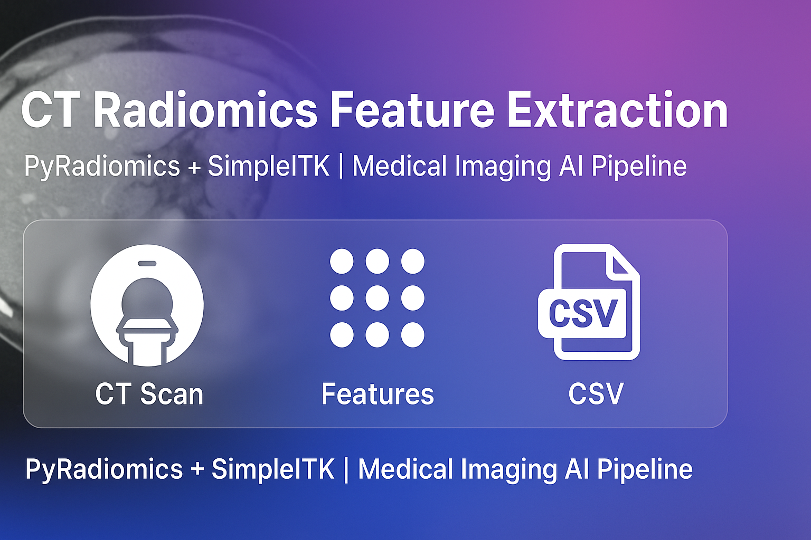
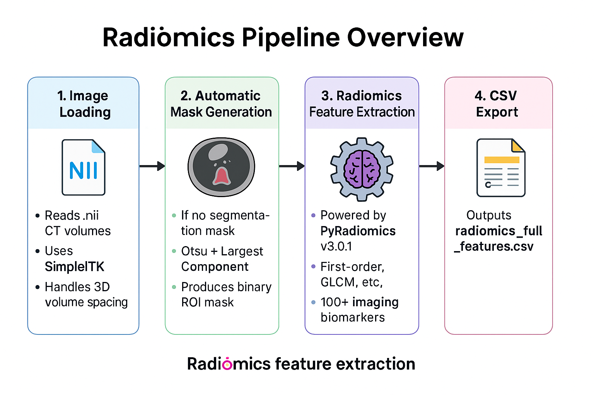

### 🧬 CT Radiomics Feature Extraction

Extract quantitative radiomics features (first-order, texture, wavelet) from CT scans and export them into a clean CSV file — ready for machine-learning, multimodal AI, or clinical modeling.

  

---

### 🧠 Radiomics Pipeline Overview

  

This project demonstrates an end-to-end radiomics workflow for medical imaging:

---

### 🧩 1. Image Loading
- Reads `.nii` CT volumes  
- Uses **SimpleITK** for robust medical image I/O  
- Handles **3D images** with native voxel spacing  

---

### 🧩 2. Automatic Mask Generation
If no segmentation mask is provided:
- **Otsu Thresholding**  
- **Largest Connected Component**  
- Produces a clean **binary ROI mask**

---

### 🧩 3. Radiomics Feature Extraction
Powered by **PyRadiomics v3.0.1**:
- First-order statistics  
- GLCM, GLSZM, GLRLM, NGTDM, Shape  
- LoG & Wavelet-filtered textures  
- Generates **100+ high-dimensional biomarkers**

---

### 🧩 4. CSV Export
All features saved into:
